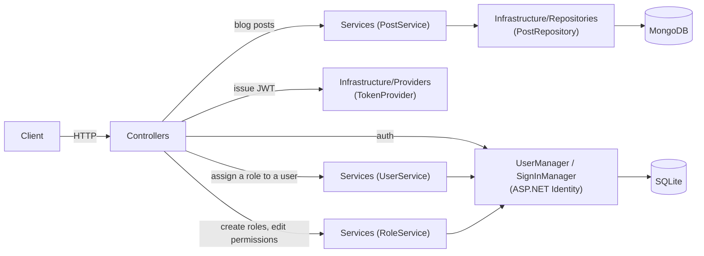

# Architecture

BlogMVC is an API-only ASP.NET Core app (`AddControllers()`, no MVC views) with two independent
persistence stores: SQLite (via EF Core) for auth/identity, and MongoDB for blog posts.

## Request flow



- **Blog posts**: `Controllers` → `Services` (business logic) → `Infrastructure/Repositories` (raw
  MongoDB driver calls) → MongoDB. `Post.Id` is a MongoDB ObjectId stored as a string, validated with
  `MongoDbHelper.IsValidObjectId` before it ever reaches the repository.
- **Auth**: `AuthController` → `UserManager`/`SignInManager` (ASP.NET Identity) → `ITokenProvider` issues
  the JWT returned to the client.
- **User administration**: `UsersController` → `IUserService`/`UserService` → `UserManager` (ASP.NET
  Identity) — replaces a user's assigned role.
- **Role administration**: `RolesController` → `IRoleService`/`RoleService` → `RoleManager`/`UserManager`
  (ASP.NET Identity) — creates/deletes roles and edits which permissions a role grants, stored as Identity
  role claims (`AspNetRoleClaims`). `RoleService` opens an explicit `ApplicationDbContext` transaction around
  each multi-step write (create role + grant claims, remove+add claims on a permission replacement,
  check-then-delete) so a failure partway through rolls back instead of leaving a role half-updated; role
  names are trimmed before use so whitespace can't create a role visually indistinguishable from an existing
  one, and a `CreateAsync` failure/race (a duplicate name slipping in between the existence check and the
  write) is mapped to a clean `DuplicateName` result rather than an unhandled exception.
- Controllers never return domain models (`Post`, `IdentityUser`) directly — they map to a type in
  `Responses/` so the wire shape stays decoupled from the persistence model.
- The two stores are wired independently and never share a transaction: a post edit and a user's
  identity data cannot be updated atomically.

## Folder structure

```
BlogMVC/
├── Controllers/          # HTTP endpoints. BaseApiController holds shared helpers (claims, ObjectId checks, ETag).
├── Services/              # Business logic (PostService, AuthService, UserService, RoleService) sitting between controllers and infrastructure.
├── Infrastructure/
│   ├── Interfaces/        # IPostRepository, ITokenProvider, IDateTimeProvider
│   ├── Providers/         # TokenProvider (JWT issuing), SystemDateTimeProvider
│   └── Repositories/      # PostRepository — the only place that talks to the MongoDB driver
├── Data/                  # EF Core ApplicationDbContext + Migrations (SQLite, Identity schema)
├── Models/                # Domain model persisted to MongoDB (Post), Identity read-models (UserSummary, RoleSummary), and config (MongoDbSettings)
├── Dto/                   # Input models for requests (CreatePostDto, EditPostDto, LoginDto, RegisterDto, UpdateUserRoleDto, CreateRoleDto, UpdateRolePermissionsDto)
├── Responses/             # Output models returned to clients (PostResponse, TokenResponse, ErrorResponse, RegisterResponse, UserRoleResponse, RoleResponse, PermissionsResponse)
├── Results/                # Internal outcome types for service calls (LoginResult, RegisterResult, PostUpdateResult, UpdateUserRoleResult, CreateRoleResult, UpdateRolePermissionsResult, DeleteRoleResult)
├── Helpers/                # Static helpers (MongoDbHelper, ClaimsPrincipalExtensions, RoleManagerExtensions, IdentityRoleSeederExtensions)
└── Program.cs             # Composition root: DI registrations, middleware pipeline

BlogMVC.Tests/
├── Controllers/           # Unit tests (Moq) for controllers
├── Services/               # Unit tests for PostService, AuthService, UserService, RoleService
├── Providers/              # Unit tests for TokenProvider
├── IntegrationTests/       # Full-stack tests via WebApplicationFactory<Program>, real MongoDB
└── Helpers/                # Test data factories (PostFactory, CreatePostDtoFactory, ...) and RoleManagerExtensions unit tests
```

## Why the split into Dto / Responses / Results

Three lookalike layers exist on purpose, each with a different job:

- **`Dto/`** — what a client sends in a request body.
- **`Responses/`** — what a controller sends back over the wire.
- **`Results/`** — what a service returns internally to a controller (e.g. `PostUpdateResult.Conflict`
  vs. `NotFound`), so the controller can pick the right HTTP status without the service knowing about
  HTTP at all.

`Models/` (`Post`) is the persistence shape and never crosses either boundary directly.

## Lifetimes

Everything under `Infrastructure/` plus `PostService` is registered as a **singleton** — they're
stateless wrappers around a shared `MongoClient`/config. `AuthService`, `UserService` and `RoleService` are
the exception: all three are **scoped**, because they depend on Identity's `UserManager`/`SignInManager`/
`RoleManager`, which are themselves scoped.

## Authorization model

Authorization checks a **permission claim**, not a role name. `Data/Roles.cs` names the predefined,
seeded-at-startup Identity roles; `Data/Permissions.cs` names the fixed set of permission claim values
(`Posts.Create`, `Posts.CreateBulk`, `Posts.EditOwn`, `Posts.EditAny`, `Posts.DeleteOwn`, `Posts.DeleteAny`,
`Users.ManageRoles`, `Roles.Manage`) — each wired to exactly one `[Authorize(Policy = ...)]` in
`Program.cs`, so this list can't grow without a matching code change.

Which roles grant which of these permissions is **runtime-editable**, not a compile-time map: each role's
permissions are stored as Identity role claims (`AspNetRoleClaims`, of claim type `Permissions.ClaimType`),
managed through `RoleManager<IdentityRole>.AddClaimAsync`/`RemoveClaimAsync`/`GetClaimsAsync`. An
administrator creates roles and edits their permission sets via `RolesController`/`IRoleService`
(see below); `Helpers/IdentityRoleSeederExtensions` seeds the 4 predefined roles with sensible default
permissions the first time each is created, but never touches an existing role's permissions again, so an
admin's edits survive a restart. At login, `AuthService` resolves the caller's permissions via
`Helpers/RoleManagerExtensions.GetPermissionsAsync` (the distinct union across every role the user holds)
and passes them to `TokenProvider.CreateToken`, which embeds one `permission` claim per entry in the JWT
alongside the `Role` claims — so a user holding multiple roles gets the union of what they grant, and a
policy never needs to know which roles exist. Because permissions are baked into the JWT at login, editing
a role's permissions takes effect for a given user only on their next login (tokens are valid for 1 hour and
carry no server-side session state to invalidate).

- Reading posts (`GET api/blog`, `GET api/blog/{id}`, `GET api/blog/search?query=`) is public. Search matches
  a case-insensitive substring against Title or Description (`PostRepository.SearchAsync`, Mongo `$or` regex
  filter); the controller rejects an empty/missing `query` with 400 before it reaches the repository.
- Creating posts (`POST api/blog`) requires `Posts.Create` (granted to Administrator/Editor/Author); bulk
  creation (`POST api/blog/bulk`) requires `Posts.CreateBulk` — narrower, Administrator/Editor only, not
  Author. A Commentator token (which grants no `Posts.*` permission) gets 403 Forbidden on both.
- Editing/deleting (`PUT`, `DELETE`) is gated by an Own/Any pair: `Posts.EditOwn`/`Posts.DeleteOwn` (granted
  to Administrator/Editor/Author) additionally require `post.AuthorId` to match the caller's id from the
  token, restricting them to the caller's own posts — mismatches return 403 Forbid, not 404, to distinguish
  "not yours" from "doesn't exist". `Posts.EditAny`/`Posts.DeleteAny` (Administrator only) skip that ownership
  check, so an Administrator can edit/delete any post.
- `POST api/auth/register` creates the Identity account as a Commentator; it's immediately usable via
  `POST api/auth/login` — there is no email confirmation or admin approval step.
- Changing a user's role (`PUT api/users/{id}/role`) requires `Users.ManageRoles` — granted to
  Administrator only. It replaces the target's entire role set with the single requested role (no
  Own/Any distinction — there's no "ownership" concept for another user's role). 404 if the user id
  doesn't exist, 400 if the requested role name isn't a role that currently exists
  (`RoleManager.RoleExistsAsync` — any role, not just the 4 predefined ones).
- Listing users (`GET api/users`) requires the same `Users.ManageRoles` permission and returns every user's
  id, username, and current role (`UserService.GetUsersAsync`, via `UserManager.Users` + `GetRolesAsync` per
  user) — meant to feed the same role-management frontend as the PUT above, not a general-purpose user
  directory.
- Role administration (`RolesController` at `api/roles`) requires `Roles.Manage` — granted to Administrator
  only — on every endpoint: `GET api/roles` (every role with its current permissions), `GET api/roles/{name}`
  (one role), `GET api/roles/permissions` (the fixed permission catalog, `Permissions.All`, for a picker UI),
  `POST api/roles` (create with an initial permission set; 409 on a duplicate name, 400 on an unrecognized
  permission), `PUT api/roles/{name}/permissions` (replace a role's entire permission set wholesale; 404/400),
  and `DELETE api/roles/{name}` (404 if missing, 409 if any user still holds the role — deleting it would
  silently strip their access).

For day-to-day commands (running the app, tests, configuration) see the main [README](../README.md).
