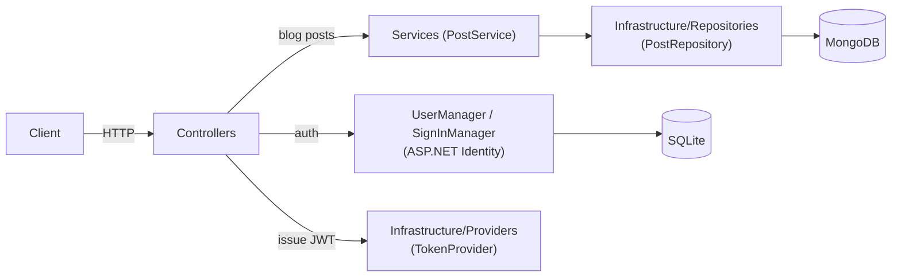

# Architecture

BlogMVC is an API-only ASP.NET Core app (`AddControllers()`, no MVC views) with two independent
persistence stores: SQLite (via EF Core) for auth/identity, and MongoDB for blog posts.

## Request flow



- **Blog posts**: `Controllers` → `Services` (business logic) → `Infrastructure/Repositories` (raw
  MongoDB driver calls) → MongoDB. `Post.Id` is a MongoDB ObjectId stored as a string, validated with
  `MongoDbHelper.IsValidObjectId` before it ever reaches the repository.
- **Auth**: `AuthController` → `UserManager`/`SignInManager` (ASP.NET Identity) → `ITokenProvider` issues
  the JWT returned to the client.
- Controllers never return domain models (`Post`, `IdentityUser`) directly — they map to a type in
  `Responses/` so the wire shape stays decoupled from the persistence model.
- The two stores are wired independently and never share a transaction: a post edit and a user's
  identity data cannot be updated atomically.

## Folder structure

```
BlogMVC/
├── Controllers/          # HTTP endpoints. BaseApiController holds shared helpers (claims, ObjectId checks, ETag).
├── Services/              # Business logic (PostService, AuthService) sitting between controllers and infrastructure.
├── Infrastructure/
│   ├── Interfaces/        # IPostRepository, ITokenProvider, IDateTimeProvider
│   ├── Providers/         # TokenProvider (JWT issuing), SystemDateTimeProvider
│   └── Repositories/      # PostRepository — the only place that talks to the MongoDB driver
├── Data/                  # EF Core ApplicationDbContext + Migrations (SQLite, Identity schema)
├── Models/                # Domain model persisted to MongoDB (Post) and config (MongoDbSettings)
├── Dto/                   # Input models for requests (CreatePostDto, EditPostDto, LoginDto, RegisterDto)
├── Responses/             # Output models returned to clients (PostResponse, TokenResponse, ErrorResponse, RegisterResponse)
├── Results/                # Internal outcome types for service calls (LoginResult, RegisterResult, PostUpdateResult)
├── Helpers/                # Static helpers (MongoDbHelper, ClaimsPrincipalExtensions)
└── Program.cs             # Composition root: DI registrations, middleware pipeline

BlogMVC.Tests/
├── Controllers/           # Unit tests (Moq) for controllers
├── Services/               # Unit tests for PostService, AuthService
├── Providers/              # Unit tests for TokenProvider
├── IntegrationTests/       # Full-stack tests via WebApplicationFactory<Program>, real MongoDB
└── Helpers/                # Test data factories (PostFactory, CreatePostDtoFactory, ...)
```

## Why the split into Dto / Responses / Results

Three lookalike layers exist on purpose, each with a different job:

- **`Dto/`** — what a client sends in a request body.
- **`Responses/`** — what a controller sends back over the wire.
- **`Results/`** — what a service returns internally to a controller (e.g. `PostUpdateResult.Conflict`
  vs. `NotFound`), so the controller can pick the right HTTP status without the service knowing about
  HTTP at all.

`Models/` (`Post`) is the persistence shape and never crosses either boundary directly.

## Lifetimes

Everything under `Infrastructure/` plus `PostService` is registered as a **singleton** — they're
stateless wrappers around a shared `MongoClient`/config. `AuthService` is the exception: it's
**scoped**, because it depends on Identity's `UserManager`/`SignInManager`, which are themselves scoped.

## Authorization model

- Reading posts (`GET api/blog`, `GET api/blog/{id}`) is public.
- Writing posts (`POST`, `POST bulk`, `PUT`, `DELETE`) requires a JWT bearer token.
- Editing/deleting additionally checks `post.AuthorId` against the caller's id from the token —
  mismatches return 403 Forbid, not 404, to distinguish "not yours" from "doesn't exist".
- `POST api/auth/register` creates the Identity account locked out; an admin must clear `LockoutEnd`
  before the user can log in via `POST api/auth/login`.

For day-to-day commands (running the app, tests, configuration) see the main [README](../README.md).
