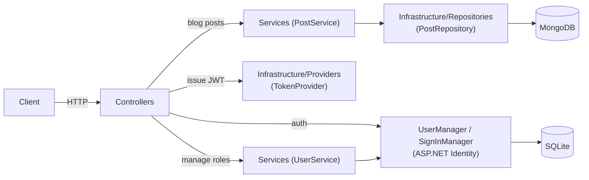

# Architecture

BlogMVC is an API-only ASP.NET Core app (`AddControllers()`, no MVC views) with two independent
persistence stores: SQLite (via EF Core) for auth/identity, and MongoDB for blog posts.

## Request flow



- **Blog posts**: `Controllers` → `Services` (business logic) → `Infrastructure/Repositories` (raw
  MongoDB driver calls) → MongoDB. `Post.Id` is a MongoDB ObjectId stored as a string, validated with
  `MongoDbHelper.IsValidObjectId` before it ever reaches the repository.
- **Auth**: `AuthController` → `UserManager`/`SignInManager` (ASP.NET Identity) → `ITokenProvider` issues
  the JWT returned to the client.
- **User administration**: `UsersController` → `IUserService`/`UserService` → `UserManager` (ASP.NET
  Identity) — replaces a user's assigned role.
- Controllers never return domain models (`Post`, `IdentityUser`) directly — they map to a type in
  `Responses/` so the wire shape stays decoupled from the persistence model.
- The two stores are wired independently and never share a transaction: a post edit and a user's
  identity data cannot be updated atomically.

## Folder structure

```
BlogMVC/
├── Controllers/          # HTTP endpoints. BaseApiController holds shared helpers (claims, ObjectId checks, ETag).
├── Services/              # Business logic (PostService, AuthService, UserService) sitting between controllers and infrastructure.
├── Infrastructure/
│   ├── Interfaces/        # IPostRepository, ITokenProvider, IDateTimeProvider
│   ├── Providers/         # TokenProvider (JWT issuing), SystemDateTimeProvider
│   └── Repositories/      # PostRepository — the only place that talks to the MongoDB driver
├── Data/                  # EF Core ApplicationDbContext + Migrations (SQLite, Identity schema)
├── Models/                # Domain model persisted to MongoDB (Post) and config (MongoDbSettings)
├── Dto/                   # Input models for requests (CreatePostDto, EditPostDto, LoginDto, RegisterDto, UpdateUserRoleDto)
├── Responses/             # Output models returned to clients (PostResponse, TokenResponse, ErrorResponse, RegisterResponse, UserRoleResponse)
├── Results/                # Internal outcome types for service calls (LoginResult, RegisterResult, PostUpdateResult, UpdateUserRoleResult)
├── Helpers/                # Static helpers (MongoDbHelper, ClaimsPrincipalExtensions)
└── Program.cs             # Composition root: DI registrations, middleware pipeline

BlogMVC.Tests/
├── Controllers/           # Unit tests (Moq) for controllers
├── Services/               # Unit tests for PostService, AuthService, UserService
├── Providers/              # Unit tests for TokenProvider
├── IntegrationTests/       # Full-stack tests via WebApplicationFactory<Program>, real MongoDB
└── Helpers/                # Test data factories (PostFactory, CreatePostDtoFactory, ...)
```

## Why the split into Dto / Responses / Results

Three lookalike layers exist on purpose, each with a different job:

- **`Dto/`** — what a client sends in a request body.
- **`Responses/`** — what a controller sends back over the wire.
- **`Results/`** — what a service returns internally to a controller (e.g. `PostUpdateResult.Conflict`
  vs. `NotFound`), so the controller can pick the right HTTP status without the service knowing about
  HTTP at all.

`Models/` (`Post`) is the persistence shape and never crosses either boundary directly.

## Lifetimes

Everything under `Infrastructure/` plus `PostService` is registered as a **singleton** — they're
stateless wrappers around a shared `MongoClient`/config. `AuthService` and `UserService` are the
exception: both are **scoped**, because they depend on Identity's `UserManager`/`SignInManager`, which
are themselves scoped.

## Authorization model

Authorization checks a **permission claim**, not a role name. `Data/Roles.cs` names the Identity roles;
`Data/Permissions.cs` names the permissions (`Posts.Create`, `Posts.CreateBulk`, `Posts.EditOwn`,
`Posts.EditAny`, `Posts.DeleteOwn`, `Posts.DeleteAny`, `Users.ManageRoles`); `Data/RolePermissions.cs` is the
static map from role to the permissions it grants. `TokenProvider` expands a user's roles into that
permission set at login and embeds one `permission` claim per entry in the JWT, alongside the `Role` claims.
`Program.cs` registers one named authorization policy per endpoint (`RequireClaim("permission", ...)` + the
JWT bearer scheme), and controllers use `[Authorize(Policy = ...)]` instead of listing role names — so a
user holding multiple roles gets the union of what they grant, and a policy never needs to know which roles
exist.

- Reading posts (`GET api/blog`, `GET api/blog/{id}`) is public.
- Creating posts (`POST api/blog`) requires `Posts.Create` (granted to Administrator/Editor/Author); bulk
  creation (`POST api/blog/bulk`) requires `Posts.CreateBulk` — narrower, Administrator/Editor only, not
  Author. A Commentator token (which grants no `Posts.*` permission) gets 403 Forbidden on both.
- Editing/deleting (`PUT`, `DELETE`) is gated by an Own/Any pair: `Posts.EditOwn`/`Posts.DeleteOwn` (granted
  to Administrator/Editor/Author) additionally require `post.AuthorId` to match the caller's id from the
  token, restricting them to the caller's own posts — mismatches return 403 Forbid, not 404, to distinguish
  "not yours" from "doesn't exist". `Posts.EditAny`/`Posts.DeleteAny` (Administrator only) skip that ownership
  check, so an Administrator can edit/delete any post.
- `POST api/auth/register` creates the Identity account as a Commentator; it's immediately usable via
  `POST api/auth/login` — there is no email confirmation or admin approval step.
- Changing a user's role (`PUT api/users/{id}/role`) requires `Users.ManageRoles` — granted to
  Administrator only. It replaces the target's entire role set with the single requested role (no
  Own/Any distinction — there's no "ownership" concept for another user's role). 404 if the user id
  doesn't exist, 400 if the requested role name isn't one of `Data.Roles.All`.
- Listing users (`GET api/users`) requires the same `Users.ManageRoles` permission and returns every user's
  id, username, and current role (`UserService.GetUsersAsync`, via `UserManager.Users` + `GetRolesAsync` per
  user) — meant to feed the same role-management frontend as the PUT above, not a general-purpose user
  directory.
- Listing assignable roles (`GET api/users/roles`) requires the same `Users.ManageRoles` permission and
  returns `Data.Roles.All` unchanged — a static, non-Identity lookup meant to feed the role dropdown in the
  same frontend, so it doesn't have to hardcode role names separately from the backend.

For day-to-day commands (running the app, tests, configuration) see the main [README](../README.md).
